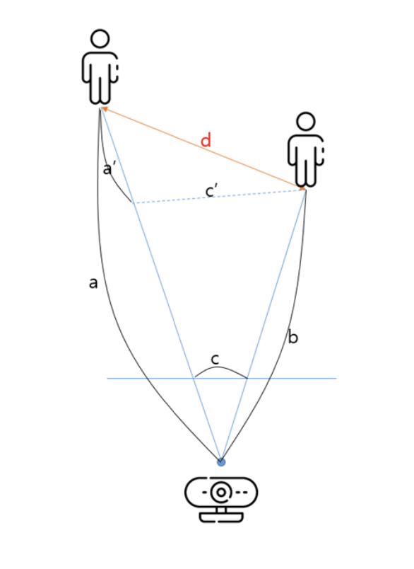
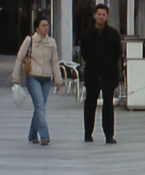
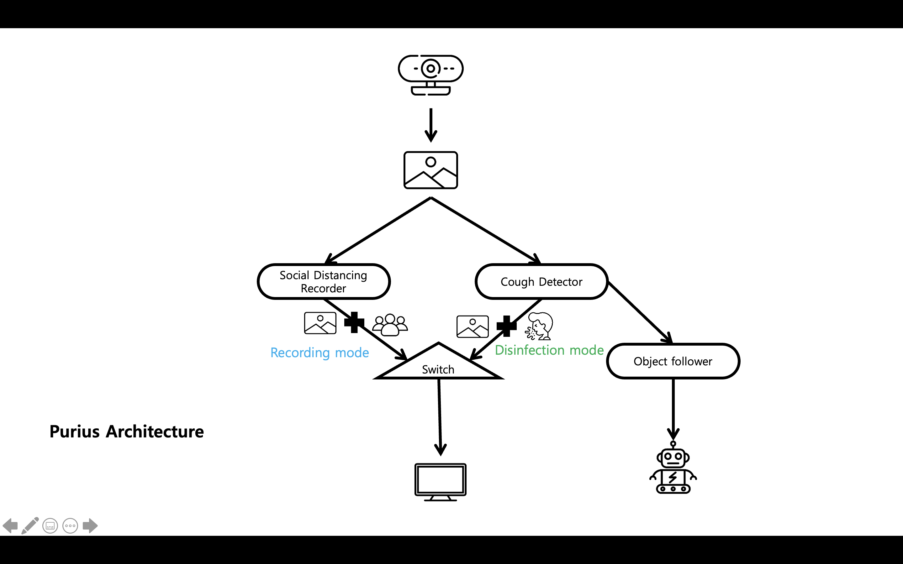
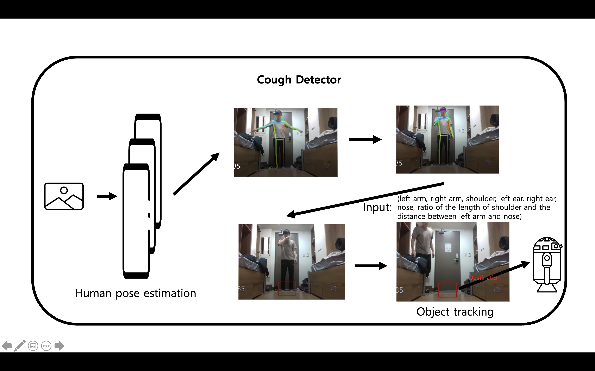
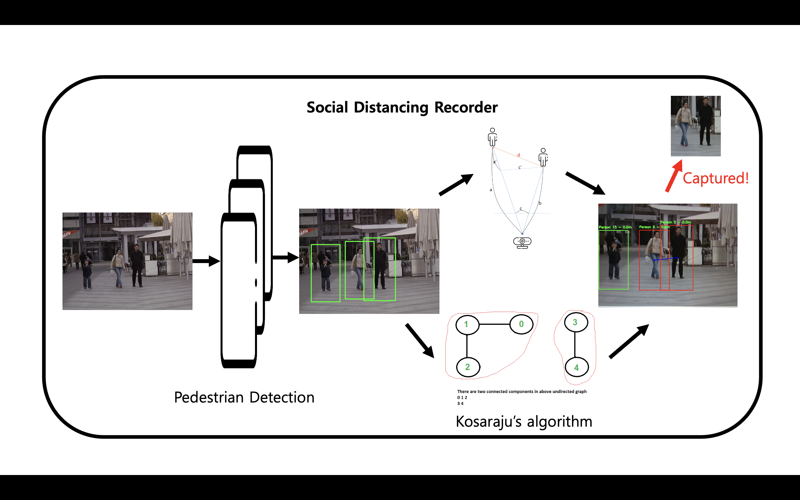
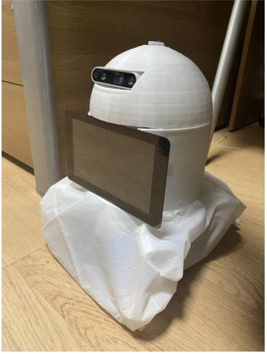

# Social-Distancing-Detectors-for-COVID-19 
> Main structures of code are brought from [people-counter](https://www.pyimagesearch.com/2018/08/13/opencv-people-counter/) and [tiny-yolo object detector](https://www.pyimagesearch.com/2020/01/27/yolo-and-tiny-yolo-object-detection-on-the-raspberry-pi-and-movidius-ncs/)

This sub-project is one of modules for `Anti-COVID19 robot` which can detect cough person and record social distancing violations. This module is for the latter which traces the close contact made by infectee in the public space with a `raspberry pi 4B`- based surveillance camera. For this purpose, we utilize the pedestrian detection and object tracing to execute computing-burden jobs in the limited hardware environment. Contact information of observed people is then collected using `Intel Realsense Depth Camera D435`.  The close contacts which last for a certain time or longer will be detected and recorded as a screenshot. In the last, an examiner only need to search and check the saved screenshots, instead of inspecting a long record of the surveillance camera.

## Start

#### Hardware requirements

* Intel Realsense Depth Camera D435 (Any depth camera will be fine)
* Raspberry pi 4B

#### Install Dependecies

1. Install the `intel realsense python sdk`
2. Install the `OpenCV`, `NumPy`, `dlib`, `imutils`

#### Execute

```shell
$ python3 main.py -s 30 -pd 150 -md 0.5 -se 10
```

* `-s`: Number of frames skipped between detections
* `-pd`: Minimum pixel euclidean distance between pedestrians for the contact detecting 
* `-md`: Minimum meter distance between pedestrians and the camera for the contact detecting
* `-se`: Minimum time (seconds) for contact to be detected

#### Output

The output will be stored as `./capture/{date-time of the contact}`

#### Demo for detection

We utilized the depth information from depth-cam to calculate 3d distance between people.



__Tracking mode__


__output screenshot (`capture/20210108-003020.png`)__



## Anti-COVID19 Robot Architecture

__Overall design__



__Cough Detector design__



__Social Distancing Recorder design__



__Robot__



