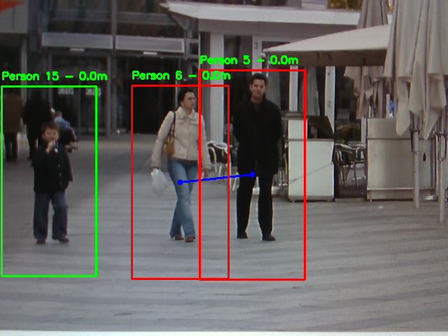

# contact-tracing-in-video-for-COVID-19 

This project is for tracing the close contact made by infectee in the public space with a `raspberry pi 4B`- based surveillance camera. For this purpose, we utilize the pedestrian detection and object tracing to execute computing-burden jobs in the limited hardware. Contact information of observed people is then collected using `Intel Realsense Depth Camera D435`.  The close contacts which last for a certain time or longer will be detected and recorded as a screenshot. In the last, an examiner only need to search and check the saved screenshots, instead of inspecting a long record of the surveillance camera.

## Start

#### Hardware requirements

* Intel Realsense Depth Camera D435 (Any depth camera will be fine)
* Raspberry pi 4B

#### Install Dependecies

1. Install the `intel realsense python sdk`
2. Install the `OpenCV`, `NumPy`, `dlib`, `imutils`

#### Execute

```shell
$ python3 contact_tracing.py -s 30 -pd 150 -md 0.5 -se 10
```

* `-s`: # of skip frames between detections
* `-pd`: the minimum pixel euclidean distance between pedestrians for the contact detecting 
* `-md`: the minimum meter distance between pedestrians and the camera for the contact detecting
* `-se`: the minimum time (seconds) for contact to be detected

#### Output

The output will be stored as `capture/{date-time of the contact}`

#### Demo

In this demo, there is no depth information. Thus, you can just ignore the things about distance information in the frame.

__Tracking mode__



__output screenshot (`capture/20210108-003020.png`)__

